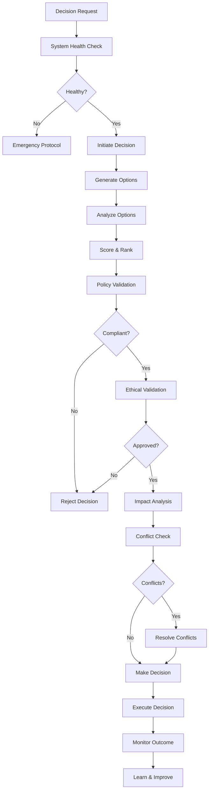

# Decision Protocol Documentation

## Overview

The Decision Protocol system enables the autonomous content service to make informed, ethical, and compliant decisions without human intervention. This comprehensive framework ensures all operational decisions are validated against policies, ethical guidelines, and system constraints while maintaining complete accountability through audit trails.

## Architecture

### Core Components

```
┌─────────────────────────────────────────────────────────────────┐
│                        Decision Service                          │
├─────────────────────────────────────────────────────────────────┤
│                                                                 │
│  ┌─────────────────┐    ┌──────────────────┐                  │
│  │ Decision Engine │    │ Policy Enforcer   │                  │
│  │                 │◄───┤                  │                  │
│  │ - Initiate      │    │ - Validate       │                  │
│  │ - Analyze       │    │ - Enforce Rules  │                  │
│  │ - Execute       │    │ - Track Violations│                  │
│  └────────┬────────┘    └──────────────────┘                  │
│           │                                                     │
│           ▼                                                     │
│  ┌─────────────────┐    ┌──────────────────┐                  │
│  │Ethical Framework│    │ Impact Analyzer   │                  │
│  │                 │◄───┤                  │                  │
│  │ - Guidelines    │    │ - Stakeholders   │                  │
│  │ - Bias Check    │    │ - Financial      │                  │
│  │ - Red Lines     │    │ - Risk Assessment│                  │
│  └─────────────────┘    └──────────────────┘                  │
│                                                                 │
│  ┌─────────────────┐    ┌──────────────────┐                  │
│  │Conflict Resolver│    │Emergency Protocol │                  │
│  │                 │    │                  │                  │
│  │ - Detect        │    │ - Health Monitor │                  │
│  │ - Resolve       │    │ - Fallback Plans │                  │
│  │ - Prioritize    │    │ - Recovery       │                  │
│  └─────────────────┘    └──────────────────┘                  │
└─────────────────────────────────────────────────────────────────┘
```

### Decision Flow



## Decision Types

### 1. Operational Decisions
- **Purpose**: Day-to-day business operations
- **Examples**: Resource allocation, task scheduling, service optimization
- **Auto-approval threshold**: 90% confidence
- **Typical execution time**: < 5 minutes

### 2. Strategic Decisions
- **Purpose**: Long-term planning and direction
- **Examples**: Service expansion, partnership agreements, capability development
- **Auto-approval threshold**: Never (requires review)
- **Typical execution time**: 24-48 hours

### 3. Financial Decisions
- **Purpose**: Monetary transactions and budgeting
- **Examples**: Payment processing, pricing adjustments, treasury operations
- **Auto-approval threshold**: Never (high risk)
- **Typical execution time**: 1-2 hours

### 4. Content Decisions
- **Purpose**: Content creation and publishing
- **Examples**: Topic selection, content approval, publishing schedule
- **Auto-approval threshold**: 85% confidence
- **Typical execution time**: < 30 minutes

### 5. Client Decisions
- **Purpose**: Client relationship management
- **Examples**: Project acceptance, service modifications, communication strategies
- **Auto-approval threshold**: 85% confidence
- **Typical execution time**: < 1 hour

### 6. Emergency Decisions
- **Purpose**: Critical system responses
- **Examples**: Security incidents, system failures, data breaches
- **Auto-approval threshold**: Immediate execution
- **Typical execution time**: < 1 minute

### 7. Ethical Decisions
- **Purpose**: Moral and ethical considerations
- **Examples**: Content guidelines, fairness assessments, bias mitigation
- **Auto-approval threshold**: 80% confidence with no red lines
- **Typical execution time**: < 30 minutes

### 8. Compliance Decisions
- **Purpose**: Regulatory and legal compliance
- **Examples**: Data handling, reporting requirements, audit responses
- **Auto-approval threshold**: Never (requires verification)
- **Typical execution time**: 2-4 hours

## Policy System

### Policy Structure

```json
{
  "id": "policy-001",
  "name": "Content Quality Standards",
  "category": "content",
  "description": "Ensures all content meets quality standards",
  "priority": 100,
  "rules": [
    {
      "id": "rule-001",
      "condition": "content_length < 100",
      "action": "reject",
      "severity": "high",
      "parameters": {
        "min_length": 100,
        "required_action": "Expand content to meet minimum length"
      },
      "exceptions": ["social_media_posts"]
    }
  ],
  "effective_from": "2024-01-01T00:00:00Z",
  "active": true
}
```

### Policy Categories

1. **General Policies**: Apply to all decisions
2. **Content Policies**: Content creation and publishing rules
3. **Financial Policies**: Monetary transaction constraints
4. **Client Policies**: Client interaction guidelines
5. **Operational Policies**: System operation rules
6. **Compliance Policies**: Legal and regulatory requirements
7. **Ethical Policies**: Moral and ethical constraints

### Rule Evaluation

Rules are evaluated using a simple condition-action model:

- **Conditions**: Boolean expressions evaluated against decision context
- **Actions**: What happens when condition is met (allow, reject, warn)
- **Severity**: Impact level (critical, high, medium, low)
- **Exceptions**: Special cases where rules don't apply

## Ethical Framework

### Core Principles

1. **Do No Harm** (Weight: 1.0)
   - Avoid physical, emotional, financial, or reputational harm
   - Red lines: Violence, hate speech, deception
   - Examples: Refuse harmful content, protect privacy

2. **Fairness and Non-Discrimination** (Weight: 0.9)
   - Equal treatment for all stakeholders
   - Red lines: Discriminatory practices, bias
   - Examples: Equal pricing, unbiased content

3. **Transparency and Honesty** (Weight: 0.9)
   - Truthful representation of capabilities
   - Red lines: Deception, hidden terms, plagiarism
   - Examples: Clear AI disclosure, honest pricing

4. **Respect for Autonomy** (Weight: 0.85)
   - Honor individual choice and consent
   - Red lines: Non-consensual data use, forced services
   - Examples: Opt-out mechanisms, consent forms

5. **Beneficence** (Weight: 0.8)
   - Actively benefit stakeholders
   - Red lines: Harmful content, resource waste
   - Examples: Valuable content, client success

6. **Environmental Responsibility** (Weight: 0.7)
   - Minimize environmental impact
   - Red lines: Excessive consumption, harmful practices
   - Examples: Efficient computing, sustainable operations

### Bias Detection

The system checks for three types of bias:

1. **Demographic Bias**
   - Scans for age, gender, race, ethnicity references
   - Recommends demographic-neutral criteria

2. **Confirmation Bias**
   - Detects limited option diversity
   - Suggests contrarian viewpoints

3. **Availability Bias**
   - Identifies over-reliance on recent events
   - Recommends historical perspective

### Ethical Scoring

```
Ethical Score = Σ(Guideline Score × Weight) / Σ(Weights)

Where:
- Guideline Score: 0.0 (violation) to 1.0 (full alignment)
- Weight: Importance of the guideline
- Minimum passing score: 0.7
```

## Decision Engine

### Option Generation

1. **Template-based**: Use successful past decisions as templates
2. **LLM-powered**: Generate novel options using AI
3. **Constraint-based**: Options must satisfy all constraints
4. **Diversity requirement**: Minimum 3 options per decision

### Scoring Algorithm

Each option is scored on five factors:

```
Total Score = (Feasibility × 0.30) +
              (Impact × 0.25) +
              ((1 - Risk) × 0.20) +
              (Alignment × 0.15) +
              (Efficiency × 0.10)
```

### Confidence Calculation

```
Confidence = Base Score × Separation Factor

Where:
- Base Score: Top option's total score
- Separation Factor: Score difference between top options
- Range: 0.0 to 1.0
```

### Justification Generation

Every decision includes:
- Selected option rationale
- Key benefits highlighted
- Risks acknowledged
- Alternative options considered
- Ethical alignment confirmed

## Emergency Protocols

### System Health Monitoring

Components monitored:
- API service
- Database connectivity
- LLM availability
- Payment systems
- Content pipeline
- Decision engine

Health score calculation:
```
Overall Health = (Σ Component Scores / Component Count) × Performance Factor
```

### Emergency Triggers

1. **Critical Failures**
   - Error rate > 50%
   - Database disconnection
   - Payment failures > 10
   - Security breach detected

2. **Degraded Performance**
   - Response time > 1000ms
   - Error rate > 5%
   - Memory usage > 90%
   - CPU usage > 85%

### Fallback Plans

#### Database Failure
1. Switch to read-only cache
2. Queue write operations
3. Activate failover database
4. Verify failover success
5. Resume normal operations

#### Payment System Failure
1. Pause payment processing
2. Switch to backup provider
3. Queue pending transactions
4. Process queued items
5. Reconcile accounts

#### LLM Service Failure
1. Switch to backup provider
2. Enable cached responses
3. Reduce service complexity
4. Monitor performance
5. Restore primary service

## Conflict Resolution

### Conflict Types

1. **Resource Conflicts**: Multiple decisions need same resources
2. **Priority Conflicts**: Competing high-priority decisions
3. **Policy Conflicts**: Conflicting policy requirements
4. **Timing Conflicts**: Overlapping execution windows

### Resolution Strategies

1. **Sequential Execution**: Execute decisions in order
2. **Priority-based**: Higher priority decisions first
3. **Resource Sharing**: Allocate partial resources
4. **Postponement**: Delay lower priority decisions
5. **Compromise**: Find middle-ground solutions

## Quality Assurance

### Decision Quality Metrics

```
Quality Score = (Success × 0.5) +
                (Confidence × 0.3) +
                (Speed × 0.2)
```

### Improvement Mechanisms

1. **Template Creation**: High-quality decisions become templates
2. **Weight Adjustment**: Update scoring weights based on outcomes
3. **Policy Refinement**: Adjust policies based on violations
4. **Guideline Evolution**: Update ethical guidelines from experience

### Learning Process

1. Assess decision outcome
2. Calculate quality score
3. Identify strengths and weaknesses
4. Extract lessons learned
5. Update decision templates
6. Adjust scoring weights

## API Integration

### Decision Management

```bash
# Create a new decision
POST /api/v1/decisions
{
  "type": "content",
  "priority": "high",
  "title": "Publish Blog Post",
  "description": "Decision to publish new blog post on AI ethics",
  "context": {
    "topic": "AI ethics",
    "word_count": 2000,
    "target_audience": "developers"
  }
}

# Get decision details
GET /api/v1/decisions/{id}

# Execute approved decision
POST /api/v1/decisions/{id}/execute

# Override with justification
POST /api/v1/decisions/{id}/override
{
  "reason": "Market conditions changed",
  "authorized_by": "admin"
}

# Assess decision quality
GET /api/v1/decisions/{id}/quality
```

### Policy Management

```bash
# Register new policy
POST /api/v1/policies
{
  "name": "Budget Limits",
  "category": "financial",
  "rules": [...],
  "priority": 100
}

# Get active policies
GET /api/v1/policies
```

### System Monitoring

```bash
# Check system health
GET /api/v1/system/health

# Activate emergency mode
POST /api/v1/system/emergency
{
  "reason": "Database failure detected"
}

# Get audit trail
GET /api/v1/audit?start=2024-01-01&end=2024-01-31
```

## Security Considerations

### Access Control

- Role-based permissions for decision override
- Multi-signature requirements for critical decisions
- Audit trail for all manual interventions
- Time-locked execution for high-value decisions

### Data Protection

- Encrypted storage of sensitive decision data
- Anonymized logging of personal information
- Secure communication channels
- Regular security audits

## Performance Optimization

### Caching Strategy

- Cache policy evaluations for 5 minutes
- Cache ethical guidelines in memory
- Cache decision templates for reuse
- Cache health metrics for 30 seconds

### Scaling Considerations

- Parallel option evaluation
- Asynchronous conflict checking
- Batch decision processing
- Load-balanced execution

## Monitoring and Alerts

### Key Metrics

1. **Decision Metrics**
   - Total decisions per hour
   - Average confidence score
   - Override rate
   - Execution success rate

2. **Policy Metrics**
   - Compliance rate
   - Violation frequency
   - Policy effectiveness

3. **System Metrics**
   - Response time
   - Error rate
   - Resource utilization
   - Health score

### Alert Thresholds

- Error rate > 5%: Warning
- Error rate > 10%: Critical
- Confidence < 60%: Review required
- Override rate > 20%: Investigation needed
- Health score < 70%: Immediate attention

## Best Practices

### Decision Making

1. Always generate multiple options
2. Document justification clearly
3. Consider stakeholder impact
4. Validate against all policies
5. Check ethical alignment
6. Monitor execution results

### Policy Design

1. Keep rules simple and clear
2. Define appropriate exceptions
3. Set realistic thresholds
4. Regular policy reviews
5. Version control policies

### Emergency Response

1. Maintain updated fallback plans
2. Test emergency procedures
3. Document recovery steps
4. Monitor system health
5. Quick escalation paths

## Troubleshooting

### Common Issues

1. **Low Confidence Scores**
   - Cause: Insufficient option diversity
   - Solution: Improve option generation

2. **High Override Rate**
   - Cause: Overly restrictive policies
   - Solution: Review and adjust policies

3. **Slow Decision Making**
   - Cause: Complex analysis requirements
   - Solution: Optimize scoring algorithms

4. **Policy Conflicts**
   - Cause: Overlapping rule definitions
   - Solution: Clarify policy boundaries

5. **Ethical Violations**
   - Cause: Missing guideline coverage
   - Solution: Expand ethical guidelines

## Future Enhancements

1. **Machine Learning Integration**
   - Learn from decision outcomes
   - Predict decision success
   - Optimize scoring weights

2. **Advanced Conflict Resolution**
   - Multi-party negotiation
   - Game theory applications
   - Automated compromise

3. **Predictive Analytics**
   - Anticipate decision needs
   - Proactive option generation
   - Risk prediction

4. **Blockchain Integration**
   - Immutable decision records
   - Decentralized validation
   - Smart contract execution