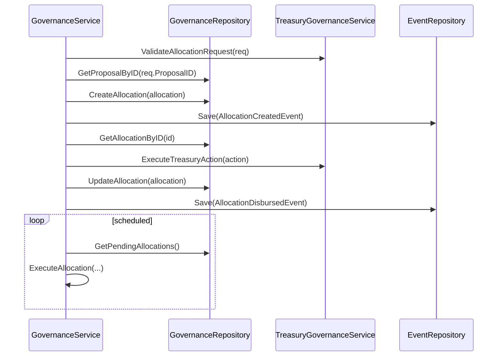

# Treasury Governance Service

This document describes the backend service methods for managing treasury allocations under DAO governance.

## Service Methods

### CreateAllocation

- Validates the allocation request via `ValidateAllocationRequest`.
- Ensures the governing proposal has executed.
- Persists a `TreasuryAllocation` record (status: Approved).
- Emits an `AllocationCreatedEvent`.

### ExecuteAllocation

- Loads the allocation record and checks that status is Approved.
- Determines payment amount (full or next installment).
- Calls `ExecuteTreasuryAction` to perform the transfer.
- Updates the allocation status to Disbursed and records timestamps.
- Emits an `AllocationDisbursedEvent`.

### ProcessInstallmentPayments

- Fetches all pending allocations with installment plans.
- For each due installment (NextPaymentDate passed), calls `ExecuteAllocation`.
- Logs errors but continues processing remaining allocations.

## Integration Flow

